# fonts

Personal font collection packaged as a Nix flake.

## What's here

- `fonts/` — bundled fonts and generated font variants.
- `flake.nix` — installs the fonts from `fonts/`.
- `assets/previews/` — generated SVG previews for README display.
- `scripts/generate_previews.py` — regenerates preview SVGs from the bundled fonts.

## Naming

Speed-reading variants are branded **Sonic** and use the variant suffix at the end of the file/full/PostScript name, e.g.:

```text
CommitMono-200-Regular-Sonic.otf
CommitMono-200-Italic-Sonic.otf
DepartureMono-Regular-Sonic.otf
```

Font metadata is normalized so managers see installable families/styles while the full names still read as `Family Weight Style Sonic`.

## Current additions

### CommitMono

- `fonts/CommitMono-200-Regular-Sonic.otf` — Sonic face built from CommitMono 200 with high-contrast 700 alternates.
- `fonts/CommitMono-200-Italic-Sonic.otf` — Sonic italic companion.
- `fonts/CommitMono-275-Regular.otf` — non-Sonic companion.
- `fonts/CommitMono-275-Italic.otf` — non-Sonic italic companion.

### Departure Mono trial

- `fonts/DepartureMono-Regular.otf` — original regular source face.
- `fonts/DepartureMono-Heavy.otf` — synthetic heavy experiment.
- `fonts/DepartureMono-Regular-Sonic.otf` — Sonic experiment with synthetic-heavy alternates.

### Other Sonic variants

- `fonts/AtkinsonHyperlegibleMono-Regular-Sonic.ttf`
- `fonts/GoMono-Regular-Sonic.ttf`
- `fonts/IosevkaTermSlab-Regular-Sonic.ttf`
- `fonts/IosevkaTermSlabCompact-Regular-Sonic.ttf`
- `fonts/IosevkaTermSlabCompact-Italic-Sonic.ttf`
- `fonts/RuneScape-Regular-Sonic.ttf`
- `fonts/Terminus-Regular-Sonic.ttf`

## Font metadata

| File | Family | Style | Full name |
| --- | --- | --- | --- |
| `CommitMono-200-Regular-Sonic.otf` | `CommitMono 200 Sonic` | `Regular` | `CommitMono 200 Regular Sonic` |
| `CommitMono-200-Italic-Sonic.otf` | `CommitMono 200 Sonic` | `Italic` | `CommitMono 200 Italic Sonic` |
| `CommitMono-275-Regular.otf` | `CommitMono 275` | `Regular` | `CommitMono 275 Regular` |
| `CommitMono-275-Italic.otf` | `CommitMono 275` | `Italic` | `CommitMono 275 Italic` |
| `DepartureMono-Heavy.otf` | `Departure Mono` | `Heavy` | `Departure Mono Heavy` |
| `DepartureMono-Regular-Sonic.otf` | `Departure Mono Sonic` | `Regular` | `Departure Mono Regular Sonic` |

Other Sonic variants follow the same metadata rule: family names end in `Sonic`, styles remain normal (`Regular` / `Italic`), and full/PostScript names place `Sonic` after the style.

## Previews

GitHub README Markdown cannot load arbitrary local fonts for live text, so these previews are generated as standalone SVGs with HarfBuzz-shaped glyph outlines. That applies OpenType features such as the Sonic `calt` substitutions while keeping font names outside the images.

Preview phrase: “Sphinx of black quartz, judge my vow.”

Regenerate the SVGs and this README section with:

```bash
nix develop -c ./scripts/generate_previews.py
```

| Font | Preview |
| --- | --- |
| `AtkinsonHyperlegibleMono-Regular-Sonic.ttf` | 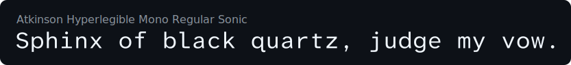 |
| `CommitMono-200-Italic-Sonic.otf` |  |
| `CommitMono-200-Regular-Sonic.otf` |  |
| `CommitMono-275-Italic.otf` | 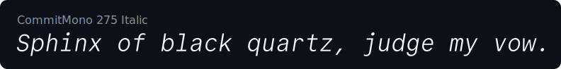 |
| `CommitMono-275-Regular.otf` |  |
| `DepartureMono-Heavy.otf` | 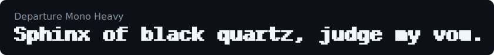 |
| `DepartureMono-Regular-Sonic.otf` | 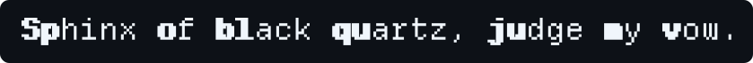 |
| `DepartureMono-Regular.otf` |  |
| `GoMono-Regular-Sonic.ttf` |  |
| `IosevkaTermSlab-Regular-Sonic.ttf` | 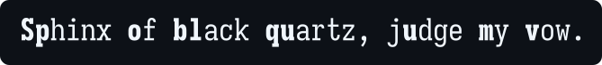 |
| `IosevkaTermSlabCompact-Bold.ttf` | 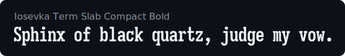 |
| `IosevkaTermSlabCompact-BoldItalic.ttf` |  |
| `IosevkaTermSlabCompact-Italic-Sonic.ttf` |  |
| `IosevkaTermSlabCompact-Italic.ttf` |  |
| `IosevkaTermSlabCompact-Light.ttf` | 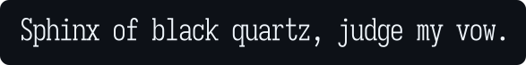 |
| `IosevkaTermSlabCompact-LightItalic.ttf` | 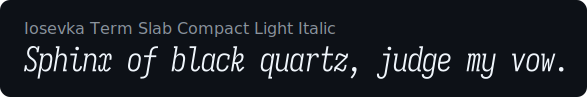 |
| `IosevkaTermSlabCompact-Regular-Sonic.ttf` |  |
| `IosevkaTermSlabCompact-Regular.ttf` | 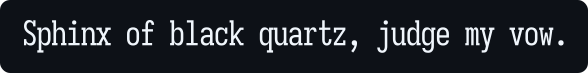 |
| `Pixel_IosevkaSlab_24.ttf` |  |
| `RuneScape-Regular-Sonic.ttf` | 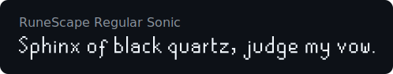 |
| `RuneScape.ttf` | 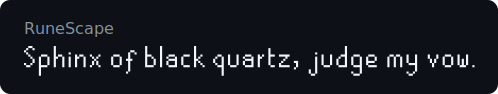 |
| `Terminus-Regular-Sonic.ttf` |  |

## Nix

```bash
nix profile install github:y0usaf/fonts
```

Or from a local checkout:

```bash
nix profile install .
```

## License

This repository is licensed under the GNU Affero General Public License v3.0 or later. See [`LICENSE`](LICENSE).

Bundled/generated font binaries may retain license requirements from their upstream source families. Keep upstream copyright and license notices where required.
